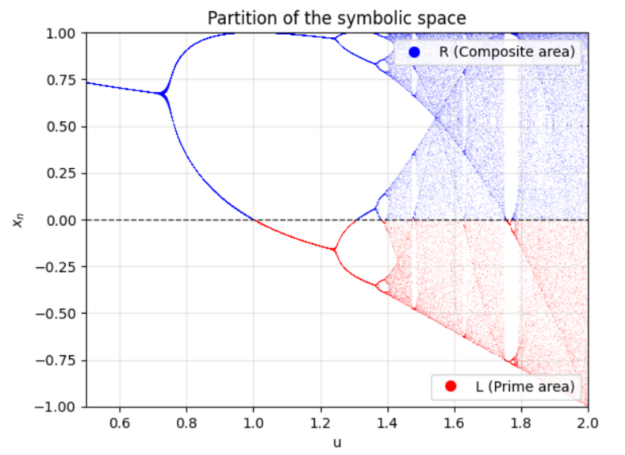
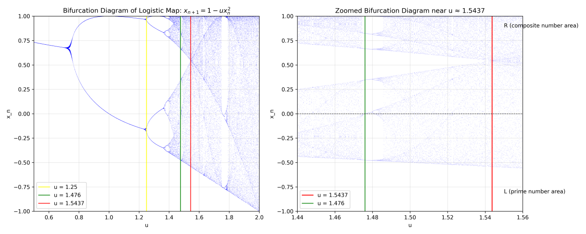
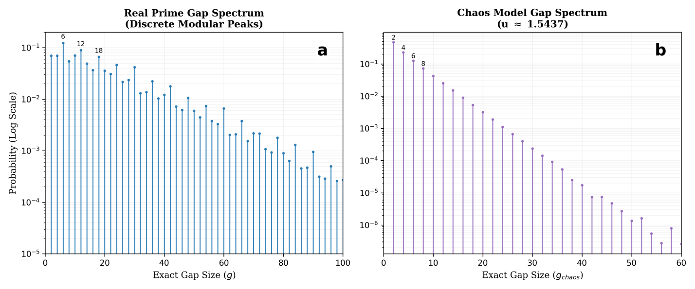
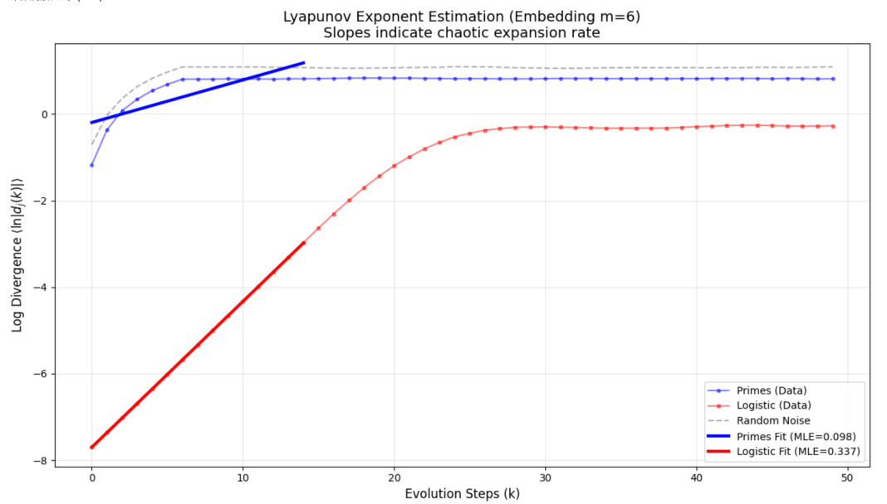
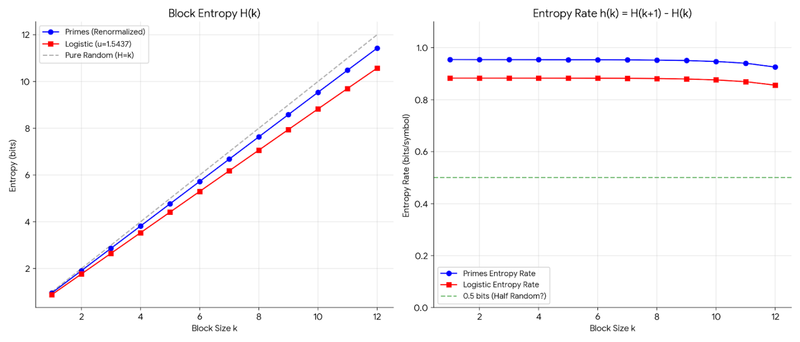
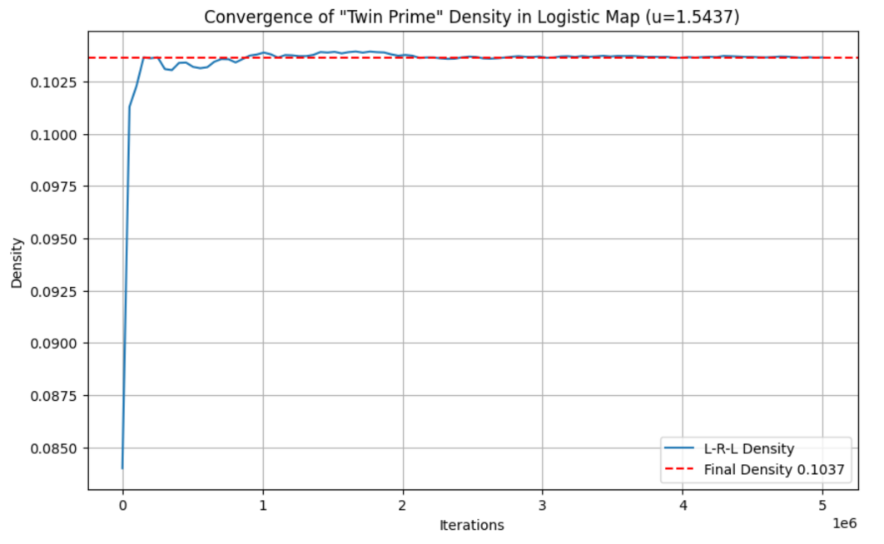
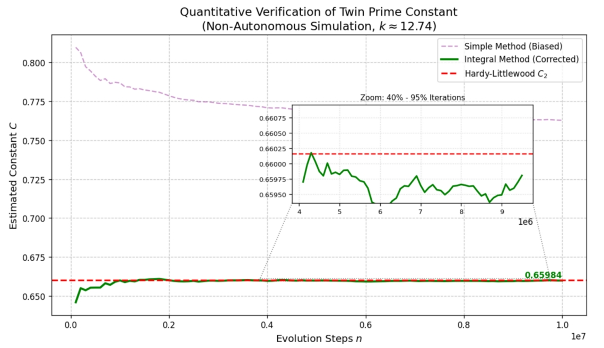
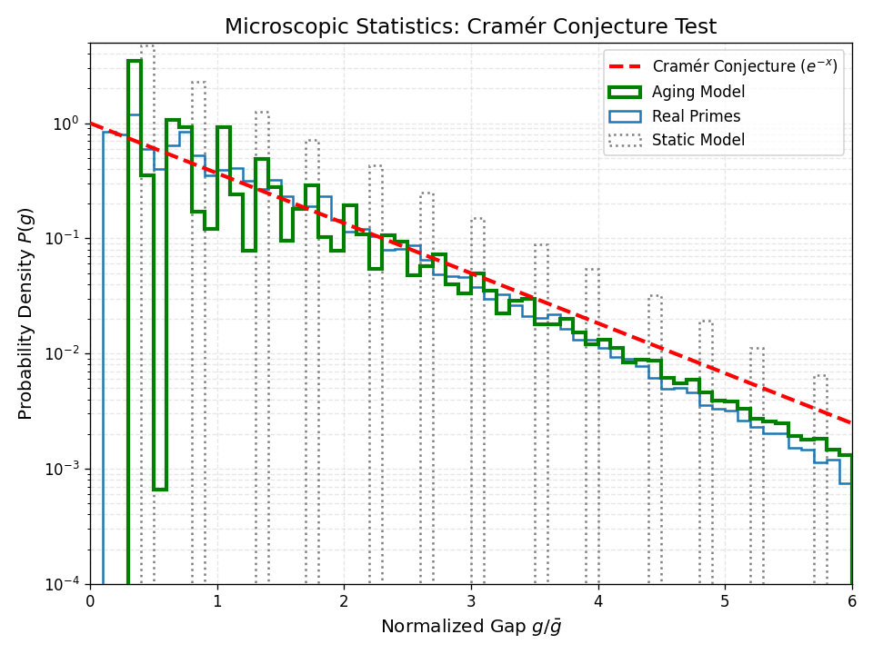

# Prime ↔ Logistic: Reproducible code for *The Emergence of Prime Distribution from Low-Dimensional Deterministic Chaos*

This repository contains the full set of Jupyter notebooks used to generate every quantitative figure in the paper:

> Liang Wang. **The Emergence of Prime Distribution from Low-Dimensional Deterministic Chaos.** *Research in Mathematics*, 2026 (Ms. No. 263595999).

Each notebook is self-contained: just open it (locally or in **Google Colab**, see badges below) and run all cells. The notebooks reproduce the exact figures shown in the paper.

---

## Quick links

| # | Notebook | Paper figure | Open in Colab |
|---|---|---|---|
| 1 | [`fig3-logistic_map.ipynb`](fig3-logistic_map.ipynb) | Fig. 3 — Symbolic partition of the Logistic map | [](https://colab.research.google.com/github/maris205/prime_logistic/blob/main/fig3-logistic_map.ipynb) |
| 2 | [`fig4-logistic_map_line.ipynb`](fig4-logistic_map_line.ipynb) | Fig. 4 — Physical localization of the prime sieve in the bifurcation diagram | [](https://colab.research.google.com/github/maris205/prime_logistic/blob/main/fig4-logistic_map_line.ipynb) |
| 3 | [`fig5-discrete_gap_spectrum.ipynb`](fig5-discrete_gap_spectrum.ipynb) | Fig. 5 — Discrete gap spectra (primes vs. Logistic vs. Cramér) | [](https://colab.research.google.com/github/maris205/prime_logistic/blob/main/fig5-discrete_gap_spectrum.ipynb) |
| 4 | [`fig6-max_lyapunov_exponent.ipynb`](fig6-max_lyapunov_exponent.ipynb) | Fig. 6 — Maximal Lyapunov exponent | [](https://colab.research.google.com/github/maris205/prime_logistic/blob/main/fig6-max_lyapunov_exponent.ipynb) |
| 5 | [`fig7-block_entropy.ipynb`](fig7-block_entropy.ipynb) | Fig. 7 — Block entropy and entropy rate | [](https://colab.research.google.com/github/maris205/prime_logistic/blob/main/fig7-block_entropy.ipynb) |
| 6 | [`fig8-twin_prime_density_logistic.ipynb`](fig8-twin_prime_density_logistic.ipynb) | Fig. 8 — Intrinsic invariant measure (twin-prime density) | [](https://colab.research.google.com/github/maris205/prime_logistic/blob/main/fig8-twin_prime_density_logistic.ipynb) |
| 7 | [`fig9-twin_prime_constant.ipynb`](fig9-twin_prime_constant.ipynb) | Fig. 9 — Convergence to the twin-prime constant | [](https://colab.research.google.com/github/maris205/prime_logistic/blob/main/fig9-twin_prime_constant.ipynb) |
| 8 | [`fig10-cramer_test.ipynb`](fig10-cramer_test.ipynb) | Fig. 10 — Test of Cramér's conjecture under the chaotic model | [](https://colab.research.google.com/github/maris205/prime_logistic/blob/main/fig10-cramer_test.ipynb) |

---

## Background in one paragraph

We model the prime distribution as the symbolic dynamics of a one-dimensional non-autonomous chaotic system: the Logistic map x → 1 − u x² with a slowly drifting parameter u(k) tied to the index of the sieve stage. The sieve sequence Q_k generated by successively introducing primes p_1, p_2, … turns out to coincide with the Metropolis–Stein–Stein (MSS) admissible sequence of the Logistic map, so each sieve stage corresponds to a precisely determined u value, and the limiting band-merging point u_c ≈ 1.5437 plays the role of the "edge of chaos" reached by the full prime distribution. The notebooks here verify this picture quantitatively along the dimensions used in the paper: spectral structure of gaps, short-range repulsion / Lyapunov exponent / block entropy, twin-prime constant, and the exponential gap distribution claimed by Cramér's conjecture.

---

## Contents

### `fig3-logistic_map.ipynb` — Fig. 3
Bifurcation diagram of the Logistic map x → 1 − u x², colored by the symbolic partition: trajectories with x > 0 are encoded as **R (composite-like)** and shown in **blue**; trajectories with x < 0 are encoded as **L (prime-like)** and shown in **red**. The dashed line marks the critical point x_c = 0.



### `fig4-logistic_map_line.ipynb` — Fig. 4
Two-panel bifurcation diagram. The left panel shows the full range u ∈ [0.5, 2.0]; the right panel zooms into u ∈ [1.44, 1.56]. Three vertical reference lines are overlaid at u = 1.250 (period-2), u ≈ 1.476 (high-order period associated with the introduction of the prime 3) and u ≈ 1.5437 (band-merging / edge-of-chaos limit). This plot makes the correspondence between sieve stages and dynamical states explicit.



### `fig5-discrete_gap_spectrum.ipynb` — Fig. 5
Discrete gap spectra of (i) real primes after renormalization, (ii) the Logistic-map orbit, (iii) the classical Cramér stochastic model. The needle structure of the prime spectrum is reproduced by the chaotic model but **not** by the stochastic model.



### `fig6-max_lyapunov_exponent.ipynb` — Fig. 6
Maximal Lyapunov exponent estimated by an improved Rosenstein algorithm (Theiler-window corrected, embedding dimension m = 6). Both the prime gap series and the Logistic orbit yield λ ≈ 0.1 (weak chaos), while a matched random control diverges to ∞.



### `fig7-block_entropy.ipynb` — Fig. 7
Block entropy H(k) and entropy rate h(k) = H(k+1) − H(k) for prime gaps and Logistic symbols. Both sequences converge to the same finite KS-entropy plateau, distinguishing them from periodic systems (h → 0) and from i.i.d. noise (h → 1).



### `fig8-twin_prime_density_logistic.ipynb` — Fig. 8
Density of the L-R-L pattern (the twin-prime analogue) along the Logistic orbit at the edge-of-chaos parameter, compared with the random-product baseline P(L)·P(R)·P(L). The chaotic model reproduces the empirical excess of twin events.



### `fig9-twin_prime_constant.ipynb` — Fig. 9
Long-run convergence of the twin-prime density estimator under the integral-corrected, non-autonomous Logistic flow towards the Hardy–Littlewood twin-prime constant 0.66016…, reaching this value spontaneously without any manual correction factor.



### `fig10-cramer_test.ipynb` — Fig. 10
Comparison between the renormalized prime-gap distribution, the Logistic-aging model (this work), the static Logistic model, and the theoretical exp(−x) of Cramér. The aging chaotic model matches the empirical primes essentially perfectly across four decades on a log scale, while the unaged static model fails.



---

## Requirements

```text
python >= 3.9
numpy
matplotlib
sympy           # only for the prime-sieve in fig5/fig6/fig7/fig10
```

That's it — no GPU, no special libraries. A standard scientific Python environment (or a free Colab runtime) is enough.

```bash
pip install numpy matplotlib sympy
jupyter notebook
```

## Reproducing the paper results

Each notebook is independent and reproduces exactly one figure of the paper. Notebooks are deterministic up to the floating-point order; the random-control plots use a fixed seed where applicable.

Some notebooks are **data-heavy** (e.g. `fig7-block_entropy.ipynb` uses primes up to 5 × 10⁶, `fig9-twin_prime_constant.ipynb` runs 10⁷ Logistic iterations). On a free Colab CPU instance these take roughly 5–15 minutes; on a modern laptop, 1–5 minutes. Constants such as `PRIME_LIMIT`, `LOGISTIC_STEPS`, `MAX_BLOCK_SIZE` are exposed at the top of each notebook so you can downscale them for a quick sanity run before launching the full version.

## Citation

If you use this code, please cite:

```bibtex
@article{wang2026emergence_prime_chaos,
  title   = {The Emergence of Prime Distribution from Low-Dimensional Deterministic Chaos},
  author  = {Wang, Liang},
  journal = {Research in Mathematics},
  year    = {2026},
  note    = {Ms. No. 263595999}
}
```

## License

Code released under the MIT License. The figures and the manuscript are © the author and subject to the publisher's policies.
